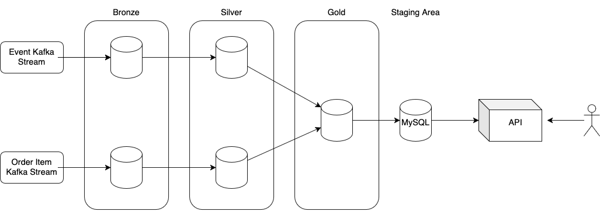
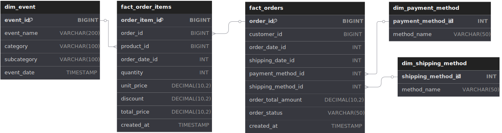
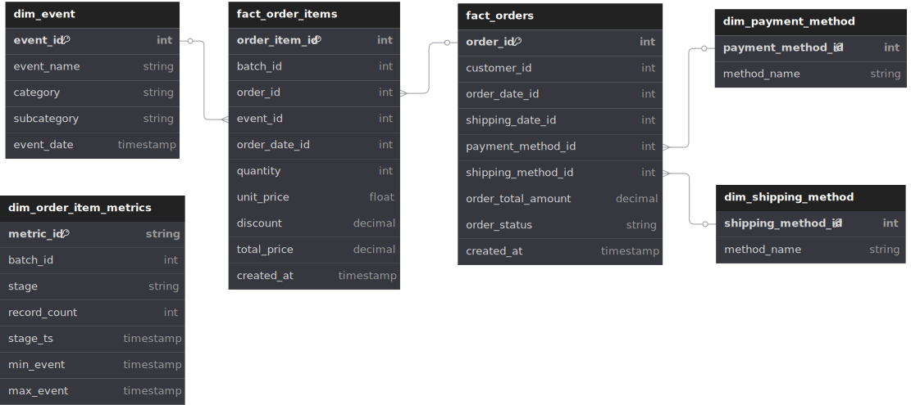

## ordre du jour

présentation du projet de monitoring de l'etl d'order item

- situation
  - contexte
  - warehouse
  - schema
- problème
- solution
  - batch_id
  - table
- encore meilleure solution

---

### contexte

- infrastructure etl
  - databrick lakehouse
  - architecture médaillon
  - delta lake pour storage
  - spark pour batch streaming
  - auncun besoin de données historique, upsert pour les changements de dimension
- staging mysql
  - <i>row level security</i>
  - integration avec l'authentification de l'api
  - beaucoup plus rapide

---

### warehouse

---

### stratégie de test
- test ETL
  - Unit test pour les transformations (pytest, pyspark.testing)
  - test d'integration entre les stages, tester la déduplication
  - voulais vrm implémenter great expectation pour data contract, schema, garbage entry (backlogged)
- test bd
  - data contract et schema
- test api
  - test fonctionnel (MockMvc)
  - test unitaire
  - test sécurité

---

## schema

---

## problème

- outils de calcul de sli de databricks limité
- aucune manière de tracker le sli e2e (ie. creation à requete)

## solution

- une table de monitoring populée à chacun des stages
  - exposer a prometheus et grafana
  - detection de bris de slo
  - alertage

---

## nouveau schema

---

## résultat

on se rend compte que le délai ne venais pas de l'etl, mais de la lecture de la base de donnés mysql.

---

## encore meilleure solution

stage de landing en scylla.
avec mon schema préféré :
aka <b>ONE BIG TABLE</b>
