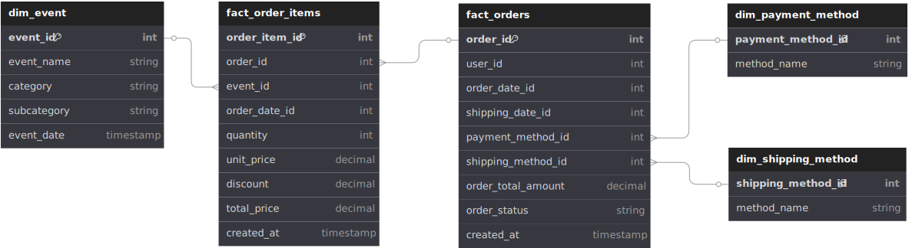

## ordre du jour
présentation du projet de monitoring de l'etl d'order item
- situation
    - contexte
    - warehouse
    - schema
- problème
- solution
    - batch_id
    - table
- encore meilleure solution
---
### contexte
- infrastructure etl déjà en place chez tm
    - databrick lakehouse
    - architecture médaillon
    - delta lake pour storage
    - spark pour batch streaming
    - auncun besoin de données historique, upsert pour les changements de dimension
- staging mysql
    - <i>row level security</i>
    - integration avec l'authentification de l'api
    - beaucoup plus rapide

---
### warehouse

---
### schema

---
### problème
- outils de calcul de sli de databricks limité
- aucune manière de tracker le sli e2e (ie. creation to staging)

### solution
- une table de monitoring populée à chacun des stages
    - exposer a prometheus et grafana

---
### nouveau schema

